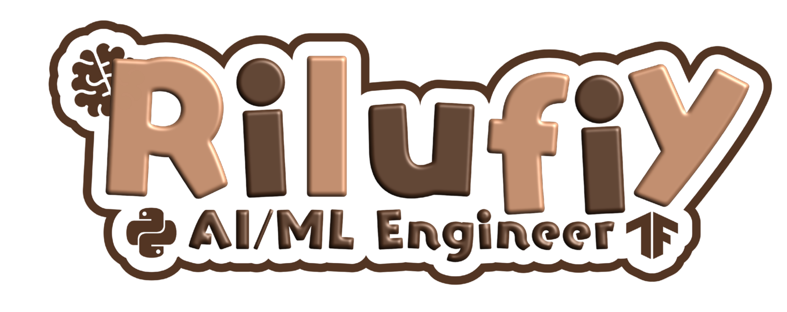

  

  

  

<h3 align="center" style="margin-top: 4px;">
Building Intelligent AI Systems with Strong Mathematical Foundations
</h3>

  

---

## 👩‍💻 About Me
I am an **AI Engineer** with a strong foundation in **Machine Learning, Deep Learning, and Generative AI**, backed by an academic background in **Mathematics**.  

I specialize in building **production-ready AI systems**, including **RAG-based chatbots**, **LLM-powered intelligent assistants**, and **computer vision models**, with an emphasis on scalability, performance, and real-world deployment.

- 🔭 Currently working on **RAG-based Chatbots & Intelligent AI Systems**  
  using **FastAPI, LangChain, and Groq**
- 🌱 Currently learning **Advanced NLP, LLM Optimization, and MLOps**
- 👨‍💻 All projects available at **https://github.com/rilufiyy**
- 💬 Ask me about **Machine Learning, Deep Learning, LSTM/GRU, RAG, LangChain, FastAPI, Computer Vision**
- 📫 Reach me at **srilutfiyadwiy@gmail.com**

---

## 🔍 NLP & LLM Stack
- Hugging Face Transformers  
- LangChain  
- Retrieval-Augmented Generation (RAG)  
- Vector Databases  
- Prompt Engineering  
- Whisper-1 (Speech-to-Text) & Text-to-Speech  

---

## 🚀 Selected Projects
- **Intelligent Customer Assistant Chatbot**  
  RAG-based chatbot using FastAPI, LangChain, and Groq with ultra-low latency LLM inference  

- **PlantPal – Plant Disease Detection App**  
  CNN-based computer vision model (97.2% validation accuracy), deployed with TensorFlow.js  

- **AI Multi-Agent System**  
  Text, image, and audio generation using OpenAI APIs, Whisper-1 STT, and TTS  

---

## 🤝 Connect with Me

  
  

---

## 🛠️ Languages & Tools

  
  
  
  
  
  
  
  
  
  
  

---

## 📊 GitHub Stats

  

  

